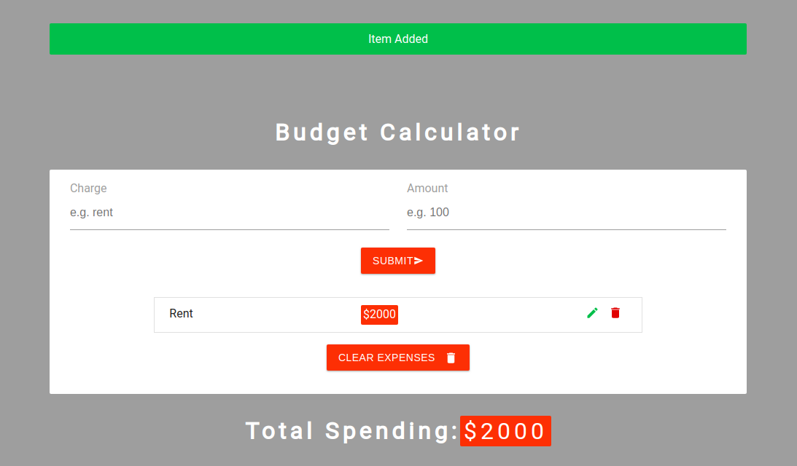

<h1 align="center">Budget Calculator</h1>

### ✨ [Demo](https://bgt-calc.netlify.app/)



Budget Calculator created using ReactJs.
This app uses the local storage, so it will keep your data even if you reload the page

## Install

```sh
git clone git@github.com:Rezan92/budget-calculator.git
cd budget-calculator
npm install
```

## Author

👤 **Rezan Al Ibrahim**

- Github: [@Rezan](https://github.com/rezan92)
